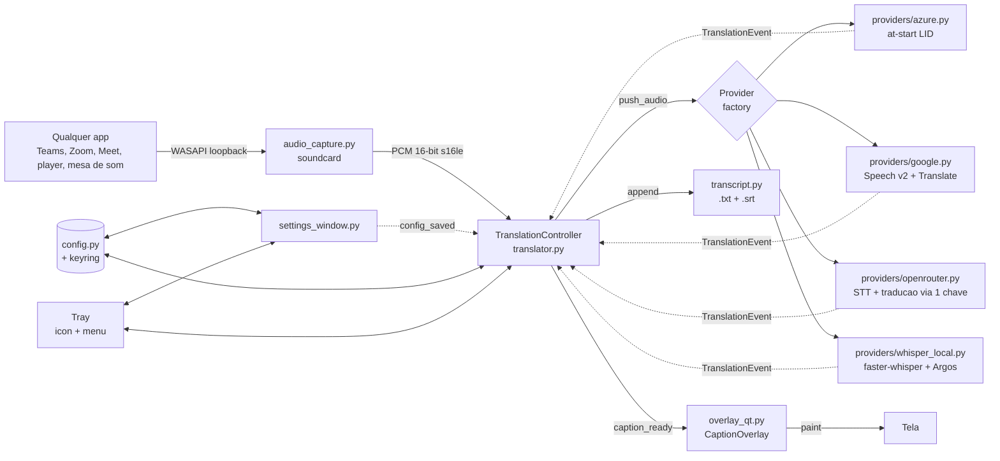

# CaptionBand

[](https://github.com/caiofabio1/captionband/actions/workflows/ci.yml)

Legenda ao vivo, traduzida, projetada sobre qualquer coisa que toque no seu
Windows.

O CaptionBand escuta a **saída de áudio do sistema** (WASAPI loopback) — não o
microfone, e não uma aplicação específica. Serve para Teams, Zoom, Meet, um
player de vídeo ou a mesa de som da sala, sem cabo virtual e sem configurar
nada no aplicativo de origem. O texto aparece numa faixa transparente sempre
visível, pensada para ser **projetada para uma plateia**: uma ou duas caixas
arrastáveis, altura fixa para a legenda não pular, e escolha de monitor para a
legenda ir ao projetor e não ao notebook do operador.

Feito para congresso bilíngue: o palestrante fala português, a tela mostra
inglês e espanhol ao mesmo tempo.

### Funciona com o que estiver tocando

Como a captura é da saída de áudio, e não de um aplicativo, a lista não é de
integrações — é de qualquer coisa que faça som no Windows:

| Situação | Como usa |
|---|---|
| Reunião ou webinar (Teams, Zoom, Meet, Webex) | Legenda o que os outros falam; nada a instalar do lado deles |
| Congresso presencial | Entrada da mesa de som como dispositivo de saída; legenda vai ao projetor |
| Vídeo, curso, podcast, live | Legenda traduzida por cima do player |
| Transmissão própria | A faixa entra na captura de tela do OBS como qualquer janela |
| Acessibilidade | Legenda no mesmo idioma, sem tradução, escolhendo um alvo só |

Nada disso exige permissão, plugin ou conta na plataforma de origem: para o
Windows é só áudio saindo pela placa.

- **5 provedores**: Azure / Google Speech v2 / OpenRouter / OpenAI Realtime / Whisper local (offline)
- **Nunca falha em silêncio**: todo erro vira aviso na bandeja e troca de provedor automática
- **Sobrevive ao evento**: reabre o áudio se o dispositivo mudar, reconecta o Azure, troca de provedor sem cortar a transcrição
- **Tela da legenda** escolhida na bandeja — o projetor em modo "estender" recebe a legenda, não o notebook
- **Checagem pré-evento** num clique: provedor, credenciais, idiomas e áudio real
- **Legenda em ordem**: resultados que chegam fora de ordem são reordenados antes da tela
- **Auto-detecta** o idioma falado (PT/EN/ES e mais)
- **Traduz para um ou mais idiomas-alvo** em paralelo (ex.: ES; ou ES + EN)
- **Modo legenda dupla**: original + tradução, ou múltiplas traduções stacked
- **Overlay PyQt6** transparente, always-on-top, click-through opcional, drag-to-reposition
- **Banda de altura fixa**: a legenda não pula na projeção conforme o texto cresce
- **Sem cabo virtual**: captura áudio do sistema via WASAPI loopback
- **GUI de configurações** com cores, posição, fontes, dispositivo de áudio
- **System tray** para iniciar/parar/configurar sem deixar janela rodando

## Antes de um evento — faça isto

```bash
python preflight.py     # ou: bandeja → "Checagem pré-evento…"
```

Testa a cadeia inteira na ordem em que ela quebra: o pacote do provedor
importa? a credencial vale? o idioma-alvo é diferente do falado? o áudio do
sistema realmente chega? Parar na primeira falha, com a frase do que fazer.
Um teste de credencial sozinho não responde "vai aparecer legenda quando
alguém falar?" — a falha mais comum em evento é o dispositivo de saída
errado, que é indistinguível de ninguém falando.

```bash
python rehearsal.py     # ensaio da pipeline com falhas injetadas (não precisa de chave)
```

## Arquitetura



## Comparativo de provedores

Preços conferidos nas páginas dos próprios fornecedores em **2026-09-14**.
Preço de API tem dono e muda sem aviso — reconfira antes de dimensionar um
evento, e trate esta tabela como datada, não como permanente.

| Provedor | Ordem da legenda | Custo/h | Traduz | Setup |
|---|---|---|---|---|
| **Azure Speech Translation** | garantida pelo protocolo | **F0: 5 h/mês grátis**; pago *não verificado* ¹ | ✅ nativo | 1 key |
| **Google Speech v2 + Translate** | garantida pelo protocolo | *não verificado* ¹ | ✅ | Service Account JSON |
| **OpenRouter** (multimodal com áudio + LLM) | reordenada pelo app | varia ² | ✅ 2º hop | 1 key |
| **OpenAI Realtime** | garantida pelo protocolo | varia | ✅ nativo | 1 key |
| **Whisper local** (offline) | reordenada pelo app | **US$ 0** | ✅ Argos | modelo baixa 1x |

¹ A página de preço da Azure renderiza os valores por JavaScript e não foi
possível ler o valor pago; o "US$ 2,50/h" que constava aqui vinha de abril/2026
e foi removido em vez de repetido sem conferência. O free tier F0 (5 h/mês de
Speech Translation) **está** confirmado na página.
² Depende do modelo escolhido. O catálogo do OpenRouter muda: o app confere, no botão **Testar conexão**, se o modelo de transcrição selecionado ainda existe.

### Qual usar num evento ao vivo

**Azure**, por dois motivos concretos:

1. **Ordem**: roda uma sessão contínua de reconhecimento, então as legendas
   saem em ordem por construção. Os provedores em bloco dependem do portão de
   reordenação do app, que corrige a ordem ao custo de um pouco de latência.
2. **Custo**: o free tier F0 dá 5 h/mês de Speech Translation — cobre um
   evento inteiro sem gasto.

Deixe **OpenRouter** configurado como **provedor de reserva** (Configurações →
Provedor): a troca é automática quando o Azure falha, e a checagem pré-evento
avisa se não houver nenhum.

### Provedores que saíram, e por quê

**Groq, Cerebras e a composição OpenAI+Cerebras foram removidos em 2026-09.**
As duas APIs recusam conexões do Brasil **antes de olhar a chave**: medido
sem credencial nenhuma, `api.cerebras.ai` devolve `403` com `error code: 1009`
(bloqueio geográfico do Cloudflare) e `api.groq.com` devolve `403 Forbidden`.
Repetindo a mesma requisição por um proxy que sai de outro país, as duas
passam a responder normalmente (`401 Invalid API Key` / `Not authenticated`),
o que prova que o bloqueio é geográfico e não de credencial.

Um provedor que não conecta não serve nem como principal nem como reserva, e
mantê-lo na lista só criava a chance de escolhê-lo na véspera de um evento.
Quem precisa deles a partir de outro país pode recuperá-los do histórico do
Git; o pipeline que os servia continua no repo como
`providers/chunked_rest.py`, que é a base do OpenRouter.

Com dois idiomas de saída (EN + ES), o app grava um `.srt` por idioma —
prontos para o YouTube — e o modo evento reserva uma linha a mais na banda.

### Modelos mais novos que ainda não estão implementados

Levantados em 2026-09-14, relevantes para este caso de uso e **ainda não
integrados** neste app:

| Modelo | Preço | Situação |
|---|---|---|
| OpenAI `gpt-realtime-translate` | US$ 0,034/min **por idioma de destino** | ✅ **implementado** — provider `openai_realtime` |
| OpenAI `gpt-live-transcribe` | US$ 0,017/min | não implementado (transcreve, não traduz) |
| Deepgram Flux / Nova-3 | US$ 0,0058–0,0078/min | não implementado (**não traduz**) |

### OpenAI Realtime Translate — leia antes de escolher

Tradução de fala em streaming num hop só, detecta o idioma falado sozinho
(70+ idiomas de entrada). Mas a API é configurada **em torno de um único
idioma de saída**, então:

> **N idiomas de destino = N sessões WebSocket = N× o custo.**
> 1 idioma ≈ US$ 2,04/h · 2 idiomas ≈ **US$ 4,08/h**

A tela de Configurações calcula esse valor ao vivo conforme você marca
idiomas, para a conta não aparecer só na fatura.

Três detalhes de implementação que importam:

- **A API exige 24 kHz**; o app captura 16 kHz. O provider reamostra. Mandar
  16 kHz dizendo que é 24 kHz não dá erro — só acelera a voz e destrói o
  reconhecimento em silêncio.
- **A API não documenta evento de fim de frase** (só `.delta`). A separação
  de frases é feita aqui, por intervalo de silêncio. Se a OpenAI publicar um
  evento de conclusão, o código já o aproveita, mas não depende dele.
- **O áudio traduzido é ignorado** — renderizamos legenda, não som. Ele ainda
  é gerado e cobrado.

**Para um evento com 2 idiomas de saída, o Azure continua melhor**: faz
multi-destino em UMA sessão e tem 5 h/mês grátis. Este provider vale quando
você quer a qualidade/latência do modelo novo e aceita o custo por idioma.

## Requisitos

- Windows 10/11 (WASAPI loopback é Windows-only)
- Conta Azure com recurso **Speech service** (tier F0 grátis: 5h/mês; S0 ~US$2.50/h)
- Para desenvolvimento: Python 3.11+

## Quick start (executável pré-compilado)

1. Baixe `CaptionBandSetup.exe` da release mais recente
2. Instale (não precisa admin)
3. Abra **CaptionBand** — vai pedir Azure Speech Key + Region na primeira execução
4. Cole sua chave + região (ex.: `brazilsouth`), salve
5. Clique no ícone na bandeja → **Iniciar tradução**
6. Arraste a faixa de legenda para onde ela deve ficar e ative **click-through** se precisar clicar no que está por baixo

## Como obter credenciais por provedor

### Azure Speech Translation

1. https://portal.azure.com → **Create a resource** → **Speech**
2. Region recomendada: **Brazil South** (menor latência no Brasil)
3. Pricing tier: **F0** (grátis, 5h/mês) ou **S0** (~US$2.50/h)
4. Após criar, abra o recurso → menu lateral **Keys and Endpoint**
5. Copie **Key 1** e **Location/Region** → cole na janela de Configurações

### OpenRouter

1. https://openrouter.ai/settings/keys → criar chave (formato `sk-or-v1-...`)
2. Cole em Configurações → aba **Credenciais** → OpenRouter
3. Aba **Provedor** → OpenRouter → escolha o **Modelo STT**
4. **Testar conexão** — ele confere a chave *e* se o modelo de transcrição
   escolhido ainda existe no catálogo, que muda sem aviso

### Google Speech v2 + Translate

1. https://console.cloud.google.com → criar projeto (ou usar existente)
2. Habilitar APIs:
   - **Cloud Speech-to-Text API**
   - **Cloud Translation API**
3. **IAM & Admin → Service Accounts → Create Service Account**
4. Roles: `Cloud Speech Client`, `Cloud Translation API User`
5. **Keys → Add Key → Create new key (JSON)** → baixa o `.json`
6. Em Configurações → Provedor → Google:
   - Cole conteúdo do JSON (ou caminho absoluto)
   - **Project ID** (encontra em "Project info" do dashboard)
   - **Location**: `global` (default), ou regional como `southamerica-east1`
   - **Recognizer ID**: `_` (default)

### Whisper local (offline)

1. Não requer credenciais — totalmente offline
2. Em Configurações → Provedor → Whisper local:
   - **Modelo**: `small` (480 MB, recomendado CPU) ou `large-v3-turbo` (1.6 GB, GPU)
   - **Device**: `cpu` (sempre funciona) ou `cuda` (precisa NVIDIA GPU + CUDA)
   - **Compute type**: `int8` (CPU) ou `float16` (GPU)
3. **Primeira execução**: baixa modelo Whisper (~480 MB–3 GB) + pacotes Argos por par de idioma (~150 MB cada). Cache em `%LOCALAPPDATA%\CaptionBand\models\`

## Modos de exibição

| Modo | O que mostra | Quando usar |
|---|---|---|
| `translations_only` | Apenas tradução no idioma de saída | Webinar em 1 idioma de público |
| `original_plus_translation` | Original (pequeno, em cima) + tradução (grande, embaixo) | Webinar acadêmico onde audiência valida |
| `translations_only_multi` | Múltiplas traduções stacked (ES + EN, etc.) | Audiência multilíngue |

## Build do executável

```bat
cd captionband
build.bat
```

Saída: `dist\CaptionBand.exe` (single-file, ~170 MB com PyQt6 + 4 providers).

Para o instalador `.exe`:

1. Instale **Inno Setup 6** (https://jrsoftware.org/isinfo.php)
2. Após `build.bat`, rode: `iscc installer.iss`
3. Saída: `Output\CaptionBandSetup.exe`

## Desenvolvimento (rodar do código)

```bat
python -m venv .venv
.venv\Scripts\activate
pip install -r requirements.txt
python translator.py
```

Para abrir só a janela de configurações:
```bat
python translator.py --settings
```

## Arquitetura

```
┌──────────────────┐     PCM 16kHz s16le      ┌──────────────────────┐
│  audio_capture   │ ───────────────────────► │  azure_translator    │
│  WASAPI loopback │                          │  at-start LID        │
└──────────────────┘                          │  + multi-target      │
                                              └──────────┬───────────┘
                                                         │ TranslationEvent
                                                         ▼
                                              ┌──────────────────────┐
                                              │   overlay_qt         │
                                              │   PyQt6 transparente │
                                              └──────────────────────┘
                                                         ▲
                                              ┌──────────┴───────────┐
                                              │  settings_window     │
                                              │  PyQt6 dialog        │
                                              └──────────────────────┘
                                                         ▲
                                              ┌──────────┴───────────┐
                                              │  translator.py       │
                                              │  tray + orchestrator │
                                              └──────────────────────┘
```

## Arquivos

| Arquivo | Função |
|---|---|
| `translator.py` | Entry point — tray icon, orquestra capture+azure+overlay |
| `config.py` | Dataclass `AppConfig` + load/save em `%LOCALAPPDATA%\CaptionBand\config.json` |
| `audio_capture.py` | WASAPI loopback via sounddevice, listagem de devices |
| `azure_translator.py` | Wrapper do `TranslationRecognizer` com identificação de idioma |
| `overlay_qt.py` | Janela transparente com texto outlined, drag, click-through |
| `settings_window.py` | GUI com tabs (Azure / Idiomas / Áudio / Aparência / Sobre) |
| `translator.spec` | Spec do PyInstaller (`pyinstaller translator.spec`) |
| `build.bat` | Cria venv, instala deps, roda PyInstaller |
| `installer.iss` | Inno Setup script para `.exe` instalador |

## Caveats e limites

- **Latência:** ~2–3s por frase. Em modo multilíngue (LID), Azure só entrega resultados finais — não há streaming intermediário. Para latência menor seria preciso fixar um único idioma-fonte.
- **Identificação de idioma:** com até 4 idiomas de origem o app usa **at-start LID** — o idioma é
  detectado nos primeiros segundos e fica fixo pela sessão. Com 5 ou mais, cai para **LID contínuo**,
  que redecide entre frases. Em qualquer modo, a Azure devolve **um dos candidatos configurados mesmo
  que nenhum tenha sido falado**, então listar idiomas que não vão ocorrer piora o resultado. Nem
  at-start nem contínuo detectam troca **dentro** da mesma frase. Para fixar à mão: F9 ou o menu da bandeja.
- **WASAPI loopback:** captura tudo que toca pelo dispositivo de saída — se você tocar música em outro app, ela também será traduzida. Use uma saída dedicada (ex.: fones USB usados só pelo Teams) ou pause outros áudios.
- **Custo Azure:** webinar de 2h tier S0 ≈ US$5. Tier F0 (grátis) tem 5h/mês.
- **Fim de fala:** o Azure precisa detectar pausa para fechar uma frase. Apresentadores que falam ininterruptamente atrasam mais.

## Troubleshooting

**"Falha ao iniciar — device not found"** — abra Configurações → Áudio → Atualizar lista, e selecione explicitamente o seu dispositivo de saída.

**Legenda não aparece** — verifique no menu da bandeja se "Mostrar legenda" está marcado. Confira `%LOCALAPPDATA%\CaptionBand\app.log`.

**"Canceled: Authentication failed"** — Speech Key inválida ou região errada. Reabra Configurações → Azure.

**Áudio cortado / palavras faltando** — aumente `samplerate` para 24000 no `config.json` e reinicie.

**Quero zerar tudo** — feche o app, delete `%LOCALAPPDATA%\CaptionBand\config.json`, abra de novo.

### Windows Defender bloqueou o instalador

A v0.3 usa a biblioteca `keyboard` (MIT) para registrar o atalho global F8. Essa biblioteca hooka a camada de teclado do sistema, o que às vezes faz o Defender ou outro antivírus marcar o instalador como suspeito.

Se isso acontecer:
- Confirme o download (botão "Mais informações" → "Executar mesmo assim" no SmartScreen)
- Ou adicione uma exceção pra `CaptionBand.exe` no Defender
- A biblioteca é open-source e amplamente usada — código em https://github.com/boppreh/keyboard

Se preferir não usar a hotkey global, remova `keyboard` do `requirements.txt` e edite Settings → Aparência → Disposição → escolha um Layout fixo (sem precisar alternar). A app funcionará sem o hook.

## v0.4.1 patch

- **Fix**: Cerebras model dropdown updated for May 2026 catalog (`llama-3.3-70b`
  was deprecated by Cerebras in Feb 2026). New default: `gpt-oss-120b`
  (production-tier, ~3000 tok/s).
- **Fix**: Cerebras "Testar conexão" now uses `models.list()` instead of a
  hardcoded model — robust against future deprecations and shows the user
  which models their account has access to.

## v0.4 highlights

- **New: OpenAI Whisper STT + Cerebras Llama composition** — paid-SLA path
  for production webinars. STT via OpenAI Whisper API (~$0.36/h, 99.9% SLA),
  translation via Cerebras Llama (free 1M tokens/day). Zero Groq dependency.
- **New: Credenciais tab** — all API keys (Cerebras, OpenAI, Groq, Azure,
  Google) live in one place. Each section has a Test button that validates
  the key before you save. The Provedor tab is now simplified to focus on
  composition selection + model tuning.
- Compositions available:
  - Azure Speech Translation
  - Groq pure (Whisper + Llama)
  - Google Speech v2 + Translate
  - Whisper local (offline)
  - Cerebras + Groq Whisper (recomendado)
  - **OpenAI Whisper + Cerebras** (paid SLA — recomendado para produção)

## Configuring OpenAI Whisper + Cerebras

1. Settings → Credenciais
2. **Cerebras**: paste key from https://inference.cerebras.ai (free tier
   ok — 1M tokens/day)
3. **OpenAI**: paste key from https://platform.openai.com/api-keys (paid
   from minute 1, ~$0.36/h)
4. Click "Testar conexão" on each
5. Settings → Provedor → dropdown → "OpenAI Whisper + Cerebras
   (paid SLA — recomendado para produção)"
6. Save

## v0.3 highlights

- **New: Cerebras provider** — Llama 3.3 70B at 1800 tok/s, free tier 1M tokens/day
  (sign up at https://inference.cerebras.ai). STT continues to use Groq Whisper Turbo.
- **New: dual layout** — Lower-Third (default) and Side Panel transcript.
  Press **F8** during a session to toggle. Customize the hotkey in
  Settings → Aparência → Disposição.
- **New: tinted rows** — each language row is tinted by its color
  (PT blue, EN green, ES orange, etc.). Centered text. Source row in italic,
  translation in bold for instant role identification.
- **New: skeleton shimmer** — placeholder appears the moment audio is sent
  to the provider; text fades in when ready. No more "blocky" appearance.

## Configuring Cerebras

1. Open Settings → Provedores
2. Paste your Cerebras API key (free at https://inference.cerebras.ai)
3. Confirm Groq API key is set (Cerebras uses it for Whisper STT)
4. Click "Testar conexão"
5. Set Provider to "Cerebras (recomendado)" and save

## Licença

MIT. Uso livre, comercial inclusive, e contribuições são bem-vindas — abra uma
issue ou um pull request. O projeto nasceu no CABSIN (Consórcio Acadêmico
Brasileiro de Saúde Integrativa) para legendar congressos bilíngues.
